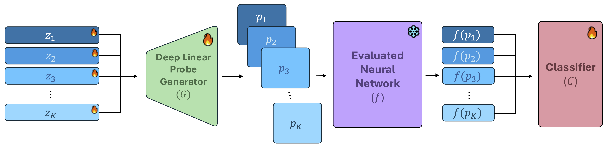

# Deep Linear Probe Generators for Weight Space Learning

Official implementation for
<pre>
<b>Deep Linear Probe Generators for Weight Space Learning</b>
<a href="https://pages.cs.huji.ac.il/jonkahana/">Jonathan Kahana</a>, <a href="https://pages.cs.huji.ac.il/eliahu-horwitz/">Eliahu Horwitz</a>, <a href="https://www.linkedin.com/in/imri-shuval-23217b207/?originalSubdomain=il">Imri Shuval</a>, <a href="https://www.cs.huji.ac.il/~yedid/">Yedid Hoshen</a>
<a href="https://arxiv.org/abs/2410.10811">https://arxiv.org/abs/2410.10811</a> 
</pre>

[](https://arxiv.org/abs/2410.10811)

<picture>
    
</picture>

## Setup environment

To run the experiments, first create a clean virtual environment and install the requirements.

```bash
conda create -n probegen python=3.9
conda activate probegen
pip install numpy pandas sklearn scipy tqdm
conda install pytorch==2.0.1 torchvision torchaudio pytorch-cuda=11.7 -c pytorch -c nvidia
```

Install the repo:

```bash
git clone https://https://github.com/jonkahana/ProbeGen.git
cd ProbeGen
```

## Datasets

### INR classification

For INR classification, we use MNIST and Fashion MNIST. **The datasets are available [here](https://www.dropbox.com/sh/56pakaxe58z29mq/AABtWNkRYroLYe_cE3c90DXVa?dl=0).**

- [MNIST INRs](https://www.dropbox.com/sh/56pakaxe58z29mq/AABtWNkRYroLYe_cE3c90DXVa?dl=0&preview=mnist-inrs.zip)
- [Fashion MNIST INRs](https://www.dropbox.com/sh/56pakaxe58z29mq/AABtWNkRYroLYe_cE3c90DXVa?dl=0&preview=fmnist_inrs.zip)

We provide the train / val / test splits as in [Neural Graphs](https://github.com/mkofinas/neural-graphs.git), inside this repository.

To download the data please run the following commands:

#### MNIST

```sh
cd experiments/inr_classification/dataset
wget "https://www.dropbox.com/sh/56pakaxe58z29mq/AABrctdu2U65jGYr2WQRzmMna/mnist-inrs.zip?dl=0" -O mnist-inrs.zip &&
  mkdir -p dataset/mnist-inrs &&
  unzip -q mnist-inrs.zip -d dataset &&
  rm mnist-inrs.zip
cd ../../..
```

#### Fashion MNIST

```sh
cd experiments/inr_classification/dataset
wget "https://www.dropbox.com/sh/56pakaxe58z29mq/AAAssoHq719OmSHSKKTiKKHGa/fmnist_inrs.zip?dl=0" -O fmnist_inrs.zip &&
  mkdir -p dataset/fmnist_inrs &&
  unzip -q fmnist_inrs.zip -d dataset &&
  rm fmnist_inrs.zip
cd ../../..
```

### CNN generalization

For CNN generalization, we use the grayscale CIFAR-10 (CIFAR10-GS) from the
[_Small CNN Zoo_](https://github.com/google-research/google-research/tree/master/dnn_predict_accuracy)
dataset, and the [_CNN Wild Park_](https://github.com/mkofinas/neural-graphs.git).
We provide the train / val / test splits as in [Neural Graphs](https://github.com/mkofinas/neural-graphs.git), inside this repository.

- [CIFAR10-GS](https://storage.cloud.google.com/gresearch/smallcnnzoo-dataset/cifar10.tar.xz)
- [CNN Wild Park](https://zenodo.org/records/12797219)

#### NFN CNN Zoo data

This experiment follows [NFN](https://arxiv.org/abs/2302.14040).
Download the
[CIFAR10](https://storage.cloud.google.com/gresearch/smallcnnzoo-dataset/cifar10.tar.xz)
data  (originally from [Unterthiner et al,
2020](https://github.com/google-research/google-research/tree/master/dnn_predict_accuracy))
into `experiments/cnn_generalization/dataset`, and extract them.

#### CNN Wild Park

[](https://doi.org/10.5281/zenodo.12797219)

Download the dataset from [Zenodo](https://doi.org/10.5281/zenodo.12797219) and extract it into `experiments/cnn_generalization/dataset`.


#### Dead-Leaves dataset

To download the Dead-Leaves dataset, please run the following commands:

```sh
cd experiments/cnn_generalization/dataset
bash download_dead_leaves.sh
```


## Running the experiments

To run a specific experiment, you can use the provided scripts in the `scripts` directory:

### Main Results

The folder `scripts/main_results` contains the scripts to reproduce the results of ProbeGen on all 4 datasets with separate scripts for 64 and 128 probes.
For example to run ProbeGen with 128 probes use the scripts:

- MNIST INR classification: `scripts/main_results/mnist_inr__ProbeGen_128.sh`
- FMNIST INR classification: `scripts/main_results/fmnist_inr__ProbeGen_128.sh`
- CIFAR10-GS Accuracy Prediction: `scripts/main_results/cifar10_gs__ProbeGen_128.sh`
- CIFAR10 Wild Park Accuracy Prediction: `scripts/main_results/cifar10_wild_park__ProbeGen_128.sh`

### Vanilla Probing

To run Vanilla Probing on a specific dataset, you can use the provided scripts in the `scripts/vanilla_probing` directory:

- MNIST INR classification: `scripts/vanilla_probing/mnist_inr__Vanilla_Probing_128.sh`
- FMNIST INR classification: `scripts/vanilla_probing/fmnist_inr__Vanilla_Probing_128.sh`
- CIFAR10-GS Accuracy Prediction: `scripts/vanilla_probing/cifar10_gs__Vanilla_Probing_128.sh`
- CIFAR10 Wild Park Accuracy Prediction: `scripts/vanilla_probing/cifar10_wild_park__Vanilla_Probing_128.sh`


### Synthetic Data

To run the synthetic data experiments, you can use the provided scripts in the `scripts/synthetic_data` directory:

- MNIST INR classification: `scripts/synthetic_data/mnist__uniform_probes_128.sh`
- FMNIST INR classification: `scripts/synthetic_data/fmnist__uniform_probes_128.sh`
- CIFAR10-GS Accuracy Prediction: `scripts/synthetic_data/cifar10_gs__Dead_Leaves_128.sh`
- CIFAR10 Wild Park Accuracy Prediction: `scripts/synthetic_data/cifar10_wild_park__Dead_Leaves_128.sh`

## Citation

If you find our work or this code to be useful in your own research, please consider citing the following paper:

```bib
@article{kahana2024deep,
  title={Deep Linear Probe Generators for Weight Space Learning},
  author={Kahana, Jonathan and Horwitz, Eliahu and Shuval, Imri and Hoshen, Yedid},
  journal={arXiv preprint arXiv:2410.10811},
  year={2024}
}
```

## Acknowledgments

- This codebase started based on [https://github.com/mkofinas/neural-graphs](https://github.com/mkofinas/neural-graphs.git) which is originally based on [github.com/AvivNavon/DWSNets](https://github.com/AvivNavon/DWSNets)

## Contributors

- [Jonathan Kahana](https://pages.cs.huji.ac.il/jonkahana/)
- [Eliahu Horwitz](https://pages.cs.huji.ac.il/eliahu-horwitz/)

